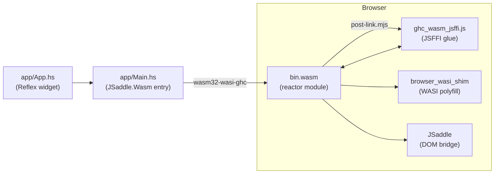

# haskell-wasm-template

A template project for building **Reflex FRP** applications compiled to WebAssembly, running in the browser via GHC's native WASM backend.

## What this demonstrates

- **Reflex FRP**: Reactive functional programming with `reflex` and `reflex-dom-core`
- **JSaddle**: Bridge between Haskell DOM operations and the browser via `jsaddle-wasm`
- **GHC WASM backend**: Compiling Haskell to `wasm32-wasi` using GHC 9.12
- **JSFFI**: JavaScript Foreign Function Interface for WASM ↔ JS interop
- **Nix devShell**: Reproducible environment via [`ghc-wasm-meta`](https://gitlab.haskell.org/haskell-wasm/ghc-wasm-meta)

## Prerequisites

- [Nix](https://nixos.org/) with flakes enabled
- [direnv](https://direnv.net/) (optional, for automatic shell activation)

## Quick start

```bash
# Enter the dev shell (provides wasm32-wasi-ghc, cabal, wasmtime, etc.)
nix develop
# or: direnv allow

# Fetch package index (first time only)
just update

# Build the WASM module + JS glue code
just build

# Start a local server with live-reload
just serve

# Open http://localhost:9834 in your browser
```

## How it works



1. **`app/App.hs`** — Reflex widget (the actual UI logic)
2. **`app/Main.hs`** — Entry point that runs the widget via `JSaddle.Wasm.run`
3. **`wasm32-wasi-ghc`** compiles to a WASI reactor module (`bin.wasm`)
4. **`post-link.mjs`** generates `ghc_wasm_jsffi.js` (JS glue from JSFFI metadata)
5. **`index.js`** loads everything, provides WASI, and calls `hs_start()`

### Key concepts

| Concept | What it means |
|---------|---------------|
| **Reflex** | Functional Reactive Programming library — `Event`, `Dynamic`, `foldDyn` |
| **JSaddle** | Haskell library that bridges DOM operations to JavaScript |
| **Reactor module** | WASM module with multiple entry points (vs "command" that runs once) |
| **JSFFI** | GHC's JS FFI — embeds JS in `foreign import javascript` declarations |
| **`post-link.mjs`** | GHC tool that extracts `ghc_wasm_jsffi` sections and emits a JS module |

## Project structure

```
├── flake.nix                    # Nix flake (flake-parts + ghc-wasm-meta)
├── cabal.project                # Cabal project config (index-state, flags)
├── haskell-wasm-template.cabal  # Package config (deps, ghc-options)
├── app/
│   ├── Main.hs                  # WASM entry point (JSaddle.Wasm.run)
│   └── App.hs                   # Reflex widget (your UI goes here)
├── index.html                   # Browser host page
├── index.js                     # WASM loader (WASI + JSFFI setup)
├── justfile                     # Build & serve commands
├── .envrc                       # direnv integration
└── .gitignore
```

## Available commands

| Command | Description |
|---------|-------------|
| `just build` | Compile WASM + generate JS glue code |
| `just serve` | Start local dev server (port 9834, live-reload) |
| `just dev` | Build then serve |
| `just update` | Fetch cabal package index (first time) |
| `just clean` | Remove build artifacts |

## Resources

- [ghc-wasm-reflex-examples](https://github.com/haskell-wasm/ghc-wasm-reflex-examples) — reference project
- [GHC User's Guide: WebAssembly backend](https://ghc.gitlab.haskell.org/ghc/doc/users_guide/wasm.html)
- [GHC WASM JSFFI docs](https://ghc.gitlab.haskell.org/ghc/doc/users_guide/wasm.html#javascript-ffi-in-the-wasm-backend)
- [ghc-wasm-meta](https://gitlab.haskell.org/haskell-wasm/ghc-wasm-meta) — toolchain provider
- [Reflex FRP](https://reflex-frp.org/) — FRP library docs
