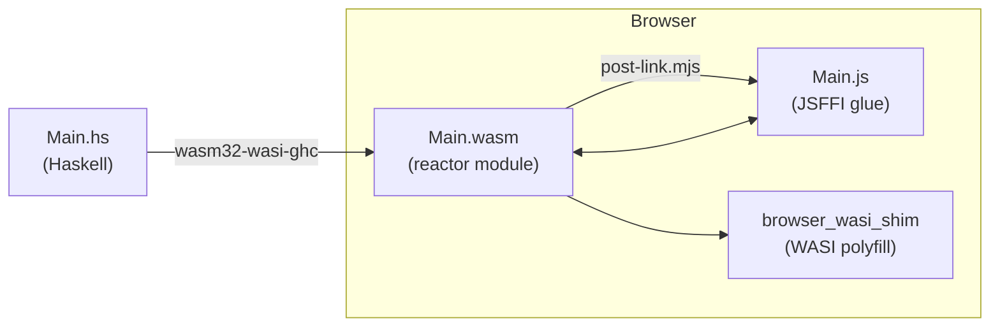

# haskell-wasm-template

A template project for compiling Haskell to WebAssembly and running it in the browser, using GHC's native WASM backend and JavaScript FFI (JSFFI).

## What this demonstrates

- **GHC WASM backend**: Compiling Haskell to `wasm32-wasi` using GHC's built-in WebAssembly code generator
- **JSFFI**: Calling JavaScript from Haskell (`foreign import javascript`) and exposing Haskell functions to JavaScript (`foreign export javascript`)
- **Browser integration**: Loading and running the compiled WASM module in a browser with [`browser_wasi_shim`](https://github.com/aspect-build/aspect/tree/main/aspect-build/aspect-build-browser-wasi-shim)
- **Nix devShell**: Reproducible development environment via [`ghc-wasm-meta`](https://gitlab.haskell.org/haskell-wasm/ghc-wasm-meta)

## Prerequisites

- [Nix](https://nixos.org/) with flakes enabled
- [direnv](https://direnv.net/) (optional, for automatic shell activation)

## Quick start

```bash
# Enter the dev shell (provides wasm32-wasi-ghc, cabal, wasmtime, etc.)
nix develop
# or: direnv allow

# Build the WASM module + JS glue code
just build

# Start a local server with live-reload
just serve

# Open http://localhost:9834 in your browser
```

## How it works



1. **`Main.hs`** → Haskell source using JSFFI to manipulate the DOM
2. **`wasm32-wasi-ghc`** compiles it to a WASI **reactor module** (`.wasm`)
3. **`post-link.mjs`** extracts JSFFI metadata from the `.wasm` and generates `Main.js` (the JS glue)
4. **`index.html`** loads `Main.wasm` + `Main.js`, provides WASI via `browser_wasi_shim`, and calls `hs_start()`

### Key concepts

| Concept | What it means |
|---------|---------------|
| **Reactor module** | A WASM module with multiple entry points (like a library), as opposed to a "command" module that runs once and exits |
| **JSFFI** | GHC's JavaScript Foreign Function Interface — embed JS snippets in `foreign import javascript` declarations |
| **`post-link.mjs`** | GHC's post-linker that reads `ghc_wasm_jsffi` custom sections from `.wasm` and emits a JS module |
| **`browser_wasi_shim`** | Provides WASI syscalls (fd_write, etc.) in the browser so the Haskell RTS can function |

## Project structure

```
├── flake.nix                    # Nix flake (flake-parts + ghc-wasm-meta)
├── haskell-wasm-template.cabal  # Cabal config (reactor module flags)
├── Main.hs                      # Haskell source with JSFFI
├── index.html                   # Browser host page
├── justfile                     # Build & serve commands
├── .envrc                       # direnv integration
└── .gitignore
```

## Available commands

| Command | Description |
|---------|-------------|
| `just build` | Compile WASM + generate JS glue code |
| `just serve` | Start local dev server (port 9834, live-reload) |
| `just dev` | Build then serve |
| `just clean` | Remove build artifacts |

## Resources

- [GHC User's Guide: WebAssembly backend](https://ghc.gitlab.haskell.org/ghc/doc/users_guide/wasm.html)
- [ghc-wasm-meta](https://gitlab.haskell.org/haskell-wasm/ghc-wasm-meta) — toolchain provider
- [GHC WASM JSFFI docs](https://ghc.gitlab.haskell.org/ghc/doc/users_guide/wasm.html#javascript-ffi-in-the-wasm-backend)
